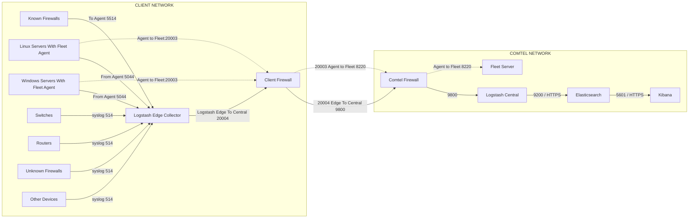

# 📡 Network Architecture & Data Flow

> **Last Updated:** May 20, 2026
> **Architecture Type:** Multi-tier ELK Stack with Fleet Agent Management

---

## 🏗️ Complete Architecture Flow



---

## 📊 Data Flow Phases

### **Phase 1: Client Network to Logstash Edge**
```
Multiple Data Sources → Logstash Edge Collector
├─ Syslog (514 UDP)           ← Firewalls, Switches, Routers, Other Devices
├─ Fleet Agents (5044 TCP)    ← Linux Servers, Windows Servers
└─ Agent to Fleet (5514)      ← Known Firewalls (via Agent)
```

### **Phase 2: Agent Registration with Fleet**
```
Fleet Agents (Client Network)
├─ Port 20003 (Local Agent Communication)
├─ Through Client Firewall
└─ To Fleet Server: Port 8220 (HTTPS)
    └─ Agent enrollment & policy management
```

### **Phase 3: Logstash Edge to Central**
```
Logstash Edge Collector
└─ Port 20004 (Edge to Central)
    └─ Through Client Firewall (port translation to 9800)
        └─ Through Comtel Firewall
            └─ To Logstash Central: Port 9800
```

### **Phase 4: Logstash Central to Elasticsearch**
```
Logstash Central
└─ Port 9200 (HTTPS)
    └─ Process & Transform Data
        └─ Send to Elasticsearch Cluster
            └─ Index storage across HOT/WARM/COLD/FROZEN tiers
```

### **Phase 5: Elasticsearch to Kibana**
```
Elasticsearch Cluster
└─ Port 5601 (HTTPS)
    └─ Kibana Interface
        └─ Visualization, Dashboards, Alerts
            └─ End-user Access
```

---

## 🔌 Port Reference Table

| **Source** | **Destination** | **Port** | **Protocol** | **Purpose** |
|-----------|-----------------|---------|------------|-----------|
| Firewalls | Logstash Edge | 514 | UDP | Syslog messages |
| Linux Servers | Logstash Edge | 5044 | TCP | Fleet Agent data |
| Windows Servers | Logstash Edge | 5044 | TCP | Fleet Agent data |
| Switches | Logstash Edge | 514 | UDP | Syslog messages |
| Routers | Logstash Edge | 514 | UDP | Syslog messages |
| Known Firewalls | Logstash Edge | 5514 | TCP | Syslog via Agent |
| Other Devices | Logstash Edge | 514 | UDP | Syslog messages |
| Fleet Agents | Fleet Server | 8220 | HTTPS | Agent enrollment & policies |
| Logstash Edge | Logstash Central | 20004 → 9800 | TCP | Edge data forwarding |
| Logstash Central | Elasticsearch | 9200 | HTTPS | Index data |
| Elasticsearch | Kibana | 5601 | HTTPS | Query & visualization |

---

## 🏢 Network Boundaries

### **CLIENT NETWORK (Customer Side)**
```
┌─────────────────────────────────────────────┐
│              CLIENT NETWORK                 │
│                                             │
│  • Linux Servers (Fleet Agents)             │
│  • Windows Servers (Fleet Agents)           │
│  • Network Firewalls (Syslog/Agent)         │
│  • Switches (Syslog)                        │
│  • Routers (Syslog)                         │
│  • Other Network Devices (Syslog)           │
│                                             │
│  ┌─────────────────────────────────────┐   │
│  │  Logstash Edge Collector            │   │
│  │  (Receives on 514, 5044, 5514)      │   │
│  │  (Sends on 20004)                   │   │
│  └─────────────────────────────────────┘   │
│              ↓ (20004)                      │
│  ┌─────────────────────────────────────┐   │
│  │     Client Firewall                 │   │
│  │  (NAT/Port Translation: 20004→9800) │   │
│  └─────────────────────────────────────┘   │
└─────────────────────────────────────────────┘
              ↓ (WAN/Internet)
```

### **COMTEL NETWORK (Comtel Side)**
```
┌──────────────────────────────────────────────┐
│           COMTEL NETWORK                     │
│                                              │
│  ┌──────────────────────────────────────┐   │
│  │     Comtel Firewall                  │   │
│  │  (NAT/Port Translation: 9800→9800)   │   │
│  └──────────────────────────────────────┘   │
│              ↓ (9800)                       │
│  ┌──────────────────────────────────────┐   │
│  │  Logstash Central                    │   │
│  │  (Aggregation & Processing Hub)      │   │
│  │  (Outputs on 9200)                   │   │
│  └──────────────────────────────────────┘   │
│              ↓ (9200)                       │
│  ┌──────────────────────────────────────┐   │
│  │  Elasticsearch Cluster               │   │
│  │  • HOT Tier (Recent: 0-7 days)       │   │
│  │  • WARM Tier (7-30 days)             │   │
│  │  • COLD Tier (30+ days)              │   │
│  │  • FROZEN Tier (Archive)             │   │
│  │  (Outputs on 5601)                   │   │
│  └──────────────────────────────────────┘   │
│              ↓ (5601)                       │
│  ┌──────────────────────────────────────┐   │
│  │  Kibana                              │   │
│  │  (Visualization & Dashboards)        │   │
│  └──────────────────────────────────────┘   │
│                                              │
│  ┌──────────────────────────────────────┐   │
│  │  Fleet Server                        │   │
│  │  (Agent Management & Enrollment)     │   │
│  │  (Listens on 8220)                   │   │
│  └──────────────────────────────────────┘   │
└──────────────────────────────────────────────┘
```

---

## 📥 Logstash Edge Input Configuration

The Logstash Edge Collector receives data from multiple sources on different ports:

```ruby
# ============================================
# LOGSTASH EDGE COLLECTOR CONFIGURATION
# ============================================

input {
  # Syslog from Firewalls, Switches, Routers, Other Devices
  udp {
    port => 514
    type => "syslog"
    codec => plain
    tags => ["syslog"]
  }

  # Fleet Agents from Linux & Windows Servers
  tcp {
    port => 5044
    type => "beats"
    codec => "json"
    tags => ["fleet-agent"]
  }

  # Syslog via Agent from Known Firewalls
  tcp {
    port => 5514
    type => "syslog-agent"
    codec => plain
    tags => ["syslog-via-agent"]
  }
}

filter {
  # Standardize timestamps
  date {
    match => [ "timestamp", "ISO8601", "MMM dd HH:mm:ss" ]
    target => "@timestamp"
  }

  # Add metadata
  mutate {
    add_field => {
      "edge_location" => "karna"
      "collection_point" => "edge_collector"
      "received_at" => "%{@timestamp}"
    }
  }
}

output {
  # Forward to Central on port 20004 (NAT translated to 9800)
  tcp {
    host => "logstash-central"
    port => 20004
    codec => json
  }

  # Optional: stdout for debugging
  stdout {
    codec => rubydebug
  }
}
```

---

## 📤 Logstash Central Output Configuration

```ruby
# ============================================
# LOGSTASH CENTRAL CONFIGURATION
# ============================================

input {
  # Receive from Edge on port 9800
  tcp {
    port => 9800
    type => "from-edge"
    codec => json
  }
}

filter {
  # Central processing: enrichment, deduplication, transformation
  mutate {
    add_field => {
      "processing_tier" => "central"
      "processed_at" => "%{@timestamp}"
    }
  }
}

output {
  # Send to Elasticsearch on port 9200
  elasticsearch {
    hosts => ["elasticsearch:9200"]
    protocol => "https"
    user => "elastic"
    password => "${ELASTIC_PASSWORD}"
    index => "logs-%{+YYYY.MM.dd}"
  }
}
```

---

## 🔐 Firewall Rules Required

### **Client Network - Outbound Rules**
```
Allow TCP 20004 → Comtel Network (Edge to Central)
Allow TCP 8220  → Comtel Network (Fleet Agents to Fleet Server)
```

### **Client Network - Inbound Rules**
```
Allow UDP 514   ← From Firewalls, Switches, Routers
Allow TCP 5044  ← From Linux/Windows Servers (Fleet Agents)
Allow TCP 5514  ← From Known Firewalls (Syslog via Agent)
```

### **Comtel Network - Inbound Rules**
```
Allow TCP 9800  ← From Client Firewall (Edge data)
Allow TCP 8220  ← From Client Firewall (Fleet Agents)
```

---

## ✅ Port Configuration Checklist

### **Logstash Edge**
- [ ] Port 514 (UDP) open for Syslog from Firewalls, Switches, Routers
- [ ] Port 5044 (TCP) open for Fleet Agents from Linux/Windows Servers
- [ ] Port 5514 (TCP) open for Syslog via Agents from Known Firewalls
- [ ] Port 20004 (TCP) configured for outbound to Central
- [ ] Network latency monitoring configured

### **Client Firewall**
- [ ] NAT Rule: 20004 (Edge) → 9800 (Central)
- [ ] NAT Rule: 8220 (Fleet) → 8220 (Fleet Server)
- [ ] Inbound Syslog (514) rules configured
- [ ] Inbound Fleet Agent (5044, 5514) rules configured

### **Comtel Firewall**
- [ ] Port 9800 (TCP) open for Edge to Central
- [ ] Port 8220 (TCP) open for Fleet Agents
- [ ] Port 9200 (HTTPS) internal for Elasticsearch
- [ ] Port 5601 (HTTPS) internal for Kibana access

### **Logstash Central**
- [ ] Port 9800 configured for inbound from Edge
- [ ] Port 9200 configured for outbound to Elasticsearch
- [ ] Connection pooling configured
- [ ] Monitoring enabled

### **Elasticsearch**
- [ ] Port 9200 (HTTPS) open for Logstash Central
- [ ] Port 9300 (Transport) open between nodes
- [ ] Cluster formation verified

### **Kibana**
- [ ] Port 5601 (HTTPS) accessible to end users
- [ ] Elasticsearch connectivity verified

---

## 🚀 Service Startup Order

```
1. Elasticsearch Cluster
   └─ Ensure all nodes join cluster
   └─ Verify cluster health: green

2. Fleet Server
   └─ Register with Elasticsearch
   └─ Listening on port 8220

3. Kibana
   └─ Connect to Elasticsearch
   └─ Verify connectivity

4. Logstash Central
   └─ Connect to Elasticsearch
   └─ Listen on port 9800
   └─ Verify inbound connections

5. Logstash Edge Collector (Client Network)
   └─ Listen on ports 514, 5044, 5514
   └─ Connect to Central on port 20004
   └─ Verify outbound connectivity

6. Fleet Agents (Client Network)
   └─ Connect to Fleet Server on port 8220
   └─ Download policies
   └─ Start collecting logs
```

---

## 🔍 Connectivity Verification Commands

### **From Client Network - Test Edge to Central**
```bash
# Test connectivity to Central (NAT translation)
telnet <comtel-firewall-ip> 9800

# Or using nc
nc -zv <comtel-firewall-ip> 9800

# Check Edge listening ports
netstat -tlnp | grep -E "514|5044|5514"
```

### **From Comtel Network - Test Central**
```bash
# Check Central is listening
netstat -tlnp | grep 9800

# Test Elasticsearch connectivity
curl -k https://elasticsearch:9200 -u elastic:password

# Test Kibana connectivity
curl -k https://kibana:5601

# Check Fleet Server
curl -k https://fleet-server:8220
```

### **Monitor Data Flow**
```bash
# On Logstash Edge: Monitor incoming connections
watch 'netstat -an | grep -E "514|5044|5514"'

# On Logstash Central: Monitor incoming from Edge
watch 'netstat -an | grep 9800'

# On Elasticsearch: Monitor indexing
curl -k https://elasticsearch:9200/_cat/indices?v -u elastic:password
```

---

## 📊 Data Volume Planning

| **Source Type** | **Volume** | **Port** | **Notes** |
|-----------------|-----------|---------|----------|
| Syslog (514) | High | 514 (UDP) | Firewalls, Switches, Routers |
| Fleet Agents (5044) | Medium | 5044 (TCP) | Linux/Windows Servers |
| Syslog via Agent (5514) | Medium | 5514 (TCP) | Known Firewalls |
| **Total Throughput** | **High** | **20004** | Edge to Central aggregation |

---

## 🔗 Important Links

- [Logstash Input Plugins](https://www.elastic.co/guide/en/logstash/current/input-plugins.html)
- [Logstash Output Plugins](https://www.elastic.co/guide/en/logstash/current/output-plugins.html)
- [Fleet Agent Documentation](https://www.elastic.co/guide/en/fleet/current/index.html)
- [Elasticsearch Documentation](https://www.elastic.co/guide/en/elasticsearch/reference/current/index.html)
- [Kibana Documentation](https://www.elastic.co/guide/en/kibana/current/index.html)

---

**Network Architecture Ready for Deployment! 🚀**
