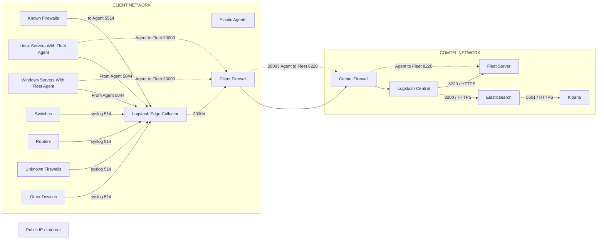

# Elastic SIEM Log Flow Architecture

## Overview

This project demonstrates a centralized Elastic SIEM log collection architecture using:

- Logstash Edge Collectors
- Logstash Central Processing
- Elasticsearch
- Kibana
- Fleet Server
- Elastic Agents

The architecture is designed for secure and scalable log collection from client environments into a centralized Elastic Stack deployment.

---

# Architecture Flow Diagram



---

# Components

## Client Network

### Log Sources

The following devices generate logs:

| Device | Protocol | Port |
|---|---|---|
| Firewalls | Syslog | 514 |
| Linux Servers | Syslog | 514 |
| Windows Servers | Syslog | 514 |
| Switches | Syslog | 514 |
| Routers | Syslog | 514 |
| Other Devices | Syslog | 514 |

---

## Elastic Agents

Elastic Agents can be installed on endpoints for advanced monitoring and telemetry collection.

| Service | Port |
|---|---|
| Beats / Elastic Agent | 5044 |
| Fleet Server Communication | 8220 |

---

# Log Flow

## Step 1 — Device Log Collection

Client devices forward logs to:

```text
Logstash Edge Collector
```

Protocols used:

- Syslog → Port 514
- Beats → Port 5044

---

## Step 2 — Secure Forwarding

The Edge Collector securely forwards logs through:

```text
Client Firewall → Comtel Firewall
```

Using:

```text
TCP Port 5044
```

---

## Step 3 — Central Processing

Logs arrive at:

```text
Logstash Central
```

Functions performed:

- Parsing
- Filtering
- Enrichment
- Normalization

---

## Step 4 — Elasticsearch Indexing

Processed logs are forwarded to:

```text
Elasticsearch
```

Using:

```text
Port 9200 (HTTPS)
```

---

## Step 5 — Visualization

Kibana connects with Elasticsearch using:

```text
Port 5601 (HTTPS)
```

Used for:

- Dashboards
- Search
- Monitoring
- Alerting

---

# Fleet Server Communication

Fleet Server manages Elastic Agents.

## Features

- Agent Enrollment
- Policy Management
- Monitoring
- Configuration Updates

## Communication Port

| Service | Port |
|---|---|
| Fleet Server | 8220 |

Agents connect through:


---

# Port Summary

| Port | Usage |
|---|---|
| 514 | Syslog Collection |
| 5044 | Beats / Log Forwarding |
| 8220 | Fleet Server Communication |
| 9200 | Elasticsearch API |
| 5601 | Kibana Web UI |

---

# End-to-End Flow

```text
Client Devices
      ↓
Logstash Edge
      ↓
Client Firewall
      ↓
Comtel Firewall
      ↓
Logstash Central
      ↓
Elasticsearch
      ↓
Kibana
```

---

# Advantages

- Centralized log collection
- Secure log forwarding
- Scalable architecture
- Elastic Agent support
- Real-time monitoring
- Easier troubleshooting
- Centralized visibility

---

# Technologies Used

- Elasticsearch
- Kibana
- Logstash
- Fleet Server
- Elastic Agent
- Syslog
- Beats Protocol

---

# Recommended Repository Structure

```text
project/
│
├── README.md
├── architecture-diagram.png
└── configs/
    ├── logstash-edge/
    ├── logstash-central/
    └── elastic-agent/
```

---
