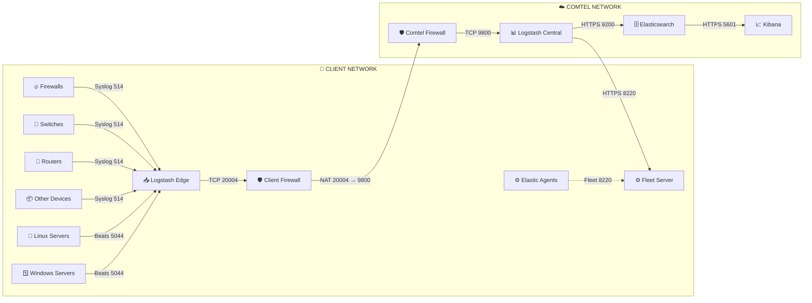

# 🚀 ELK Stack Multi-Tier Architecture

> Centralized log collection and monitoring architecture using Elasticsearch, Logstash, Kibana, Fleet Server, and Elastic Agents.

---

# 📖 Architecture Overview

This architecture provides centralized log collection and processing using:

- Logstash Edge Collectors
- Centralized Logstash Processing
- Elasticsearch Cluster
- Kibana Visualization
- Fleet Server for Agent Management

The design supports scalable, secure, and distributed log ingestion across multiple client environments.

---

# 🏗️ Architecture Flow Diagram



---

# 📊 Data Flow

## Phase 1 — Device Log Collection

Client devices send logs to the Logstash Edge collector.

| Device Type | Protocol | Port |
|---|---|---|
| Firewalls | Syslog | 514 |
| Linux Servers | Beats | 5044 |
| Windows Servers | Beats | 5044 |
| Switches | Syslog | 514 |
| Routers | Syslog | 514 |
| Other Devices | Syslog | 514 |

---

## Phase 2 — Edge to Central

Logs are securely forwarded:

```text
Logstash Edge → Client Firewall → Comtel Firewall → Logstash Central
```

Using:

```text
TCP Port 20004 → NAT → 9800
```

---

## Phase 3 — Central Processing

Logstash Central performs:

- Parsing
- Filtering
- Enrichment
- Normalization

---

## Phase 4 — Elasticsearch Indexing

Processed logs are indexed into Elasticsearch.

```text
Port: 9200 / HTTPS
```

---

## Phase 5 — Visualization

Kibana provides:

- Dashboards
- Search
- Alerting
- Monitoring

```text
Port: 5601 / HTTPS
```

---

# ⚙️ Fleet Server Communication

Fleet Server manages Elastic Agents.

| Service | Port |
|---|---|
| Fleet Server | 8220 |

Functions:

- Agent Enrollment
- Policy Management
- Health Monitoring
- Configuration Updates

---

# 🔌 Port Reference

| Port | Protocol | Purpose |
|------|-----------|----------|
| 514 | UDP | Syslog Collection |
| 5044 | TCP | Beats / Elastic Agent |
| 8220 | HTTPS | Fleet Server |
| 9200 | HTTPS | Elasticsearch API |
| 5601 | HTTPS | Kibana UI |
| 20004 | TCP | Edge to Central Forwarding |
| 9800 | TCP | NAT Translated Central Port |

---

# 🔄 End-to-End Flow

```text
Devices
   ↓
Logstash Edge
   ↓
Client Firewall
   ↓
Comtel Firewall
   ↓
Logstash Central
   ↓
Elasticsearch
   ↓
Kibana
```

---

# 📥 Logstash Edge Example

```ruby
input {

  udp {
    port => 514
    type => "syslog"
  }

  tcp {
    port => 5044
    type => "beats"
  }
}

output {

  tcp {
    host => "logstash-central"
    port => 20004
    codec => json
  }
}
```

---

# 📤 Logstash Central Example

```ruby
input {

  tcp {
    port => 9800
    codec => json
  }
}

output {

  elasticsearch {
    hosts => ["https://elasticsearch:9200"]
    index => "logs-%{+YYYY.MM.dd}"
  }
}
```

---

# 🔐 Firewall Rules

## Client Network

### Inbound

```text
UDP 514   ← Syslog Devices
TCP 5044  ← Elastic Agents
```

### Outbound

```text
TCP 20004 → Comtel Network
TCP 8220  → Fleet Server
```

---

## Comtel Network

### Inbound

```text
TCP 9800 ← Logstash Edge
TCP 8220 ← Elastic Agents
```

---

# ✅ Architecture Benefits

- Centralized logging platform
- Secure firewall-separated design
- Scalable edge collection
- Fleet-based agent management
- Easy troubleshooting
- Real-time monitoring
- Distributed processing model
- Elasticsearch scalability

---

# 📌 Deployment Notes

- Use TLS encryption wherever possible
- Enable Logstash persistent queues
- Configure Elasticsearch ILM policies
- Monitor JVM memory usage
- Enable Kibana authentication
- Restrict access using firewall rules

---

# 📂 Recommended Repository Structure

```text
ELK-config/
│
├── README.md
├── architecture-diagram.png
├── configs/
│   ├── logstash-edge/
│   ├── logstash-central/
│   └── elastic-agent/
```

---

# 🛠️ Technologies Used

- Elasticsearch
- Kibana
- Logstash
- Fleet Server
- Elastic Agent
- Syslog
- Beats Protocol

---

# 📜 License

This project is intended for internal infrastructure and monitoring deployments.

---
