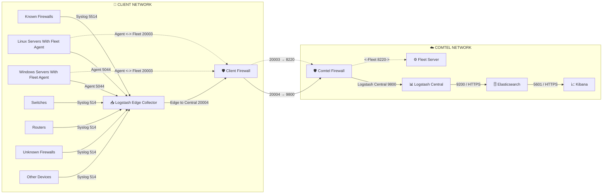

# 🚀 ELK Stack Multi-Tier Architecture


> Centralized log collection and monitoring architecture using Elasticsearch, Logstash, Kibana, Fleet Server, and Elastic Agents.

---

# 📑 Table of Contents

- [Objective](#-objective)
- [Architecture Overview](#-architecture-overview)
- [Architecture Flow Diagram](#-architecture-flow-diagram)
- [Data Flow](#-data-flow)
- [Fleet Server Communication](#-fleet-server-communication)
- [Port Reference](#-port-reference)
- [Logstash Configurations](#-logstash-configurations)
- [Firewall Rules](#-firewall-rules)
- [Security Recommendations](#-security-recommendations)
- [Index Lifecycle Management](#-index-lifecycle-management)
- [Monitoring Recommendations](#-monitoring-recommendations)
- [Architecture Benefits](#-architecture-benefits)
- [Deployment Notes](#-deployment-notes)
- [Troubleshooting](#-troubleshooting)
- [Repository Structure](#-repository-structure)

---

# 🎯 Objective

This architecture is designed to:

- Centralize logs from distributed environments
- Improve security visibility
- Enable SIEM monitoring
- Provide scalable log ingestion
- Simplify troubleshooting
- Support Elastic Agent deployments

---

# 📖 Architecture Overview

This solution provides a centralized logging platform using:

- Logstash Edge Collectors
- Logstash Central Processing
- Elasticsearch Cluster
- Kibana Dashboards
- Fleet Server
- Elastic Agents

The architecture separates the **Client Network** and **Comtel Network** using secure firewall boundaries and NAT translation.

---

# 🏗️ Architecture Flow Diagram



---

# 🔄 Data Flow

## Phase 1 — Log Collection

Client devices send logs to Logstash Edge Collector.

| Source | Protocol | Port |
|---|---|---|
| Linux Servers | Agent | 5044 |
| Windows Servers | Agent | 5044 |
| Switches | Syslog | 514 |
| Routers | Syslog | 514 |
| Unknown Firewalls | Syslog | 514 |
| Known Firewalls | Syslog To Agent | 5514 |

---

## Phase 2 — Edge to Central Forwarding

```text
Logstash Edge
    ↓
Client Firewall
    ↓
Comtel Firewall
    ↓
Logstash Central
```

Using:

```text
TCP 20004 → NAT → 9800
```

---

## Phase 3 — Elasticsearch Processing

```text
Logstash Central → Elasticsearch
```

Port:

```text
9200 / HTTPS
```

Functions:

- Parsing
- Filtering
- Enrichment
- Indexing

---

## Phase 4 — Visualization

```text
Elasticsearch → Kibana
```

Port:

```text
5601 / HTTPS
```

Features:

- Dashboards
- Search
- Alerting
- Monitoring

---

# ⚙️ Fleet Server Communication

Elastic Agents communicate with Fleet Server.

| Service | Port |
|---|---|
| Fleet Server | 8220 |

```text
TCP 20003 → NAT → 8220
```

Features:

- Agent Enrollment
- Policy Management
- Monitoring
- Configuration Updates

---

# 🔌 Port Reference

| Port | Protocol | Purpose |
|------|-----------|----------|
| 514 | UDP | Syslog Collection |
| 5044 | TCP | Syslog to Elastic Agent |
| 5514 | TCP | Syslog via Agent |
| 8220 | HTTPS | Fleet Server communication |
| 9200 | HTTPS | Elasticsearch API |
| 5601 | HTTPS | Kibana UI |
| 20004 | TCP | Logstash Edge to Logstash Central |
| 20003 | TCP | Client Agent To Fleet Server |
| 9800 | TCP | Logstash To Logstash |

---


# 🔐 Firewall Rules

## Client Network

### Logstash Inbound

```text
UDP 514   ← Syslog Devices
TCP 5044  ← Elastic Agents
TCP 5514  ← Known Firewalls
TCP 20003 ← Agent to Fleet Manager Communication
```

### Logstash Outbound

```text
TCP 20004 → To Central Logstash 
TCP 20003 → Agent to Fleet Manager Communication
```

### Windows/Linux System Outbound

```text
TCP 5044 → Elastic Agent To Logstash Edge
TCP 20003  → Agent to Fleet Manager Communication
```
### Firewall Outbound 

```text
TCP 20004 → To Central Logstash
TCP 20003 → Agent to Fleet Manager Communication
```

### Firewall Inbound

```text
TCP 20003 → Agent to Fleet Manager Communication
```

---

## Comtel Network

### Firewall Inbound 

```text
TCP 20004 → To Central Logstash
TCP 20003 → Agent to Fleet Manager Communication
```

### Firewall Outbound

```text
TCP 8220 → Agent to Fleet Manager Communication
```

---


# 🗄️ Index Lifecycle Management

| Tier | Retention |
|------|------------|
| HOT | 0–7 Days |
| WARM | 7–30 Days |
| COLD | 30–90 Days |
| FROZEN | Archive |

---

# 📈 Monitoring Recommendations

- Monitor JVM Heap Usage
- Monitor Pipeline Delays
- Monitor Elasticsearch Cluster Health
- Monitor Disk Utilization
- Monitor Fleet Agent Status

---


# 📌 Deployment Notes

- Use TLS wherever possible
- Configure Elasticsearch snapshots
- Enable Kibana authentication
- Monitor Logstash queues
- Configure ILM policies
- Use dedicated ingest pipelines

---
# NEED TO EDIT
# 🔍 Troubleshooting

## Check Listening Ports

```bash
netstat -tulnp | grep -E "514|5044|5514|9800"
```

---

## Check Elasticsearch Health

```bash
curl -k https://localhost:9200/_cluster/health
```

---

## Check Fleet Server

```bash
curl -k https://fleet-server:8220
```

---

## Check Kibana

```bash
curl -k https://localhost:5601
```

---


# 🚀 Future Improvements

- Multi-node Elasticsearch Cluster
- High Availability Logstash
- Kafka Integration
- GeoIP Enrichment
- Load Balancer for Fleet Server

---

# 👨‍💻 Maintainer

Bhautik  Patil
Comtel Infrastructure Team

---

# 📜 License

Internal Infrastructure Documentation

---
